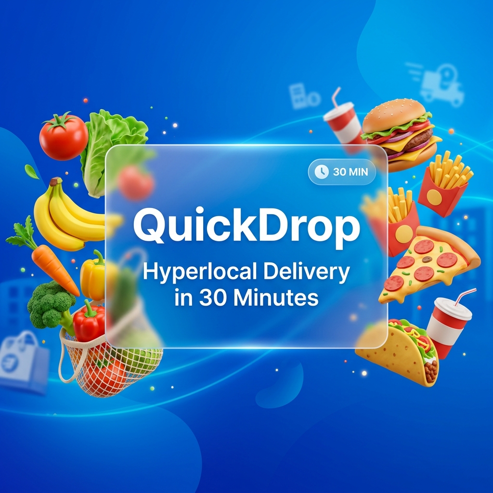

<div align="center">
  
  <h1>QuickDrop Progressive Web App</h1>
  <p><strong>A high-performance, responsive, and seamless E-Commerce & Delivery application designed for modern web standards.</strong></p>
</div>

<div align="center">
  
</div>

<br/>

## 🚀 Overview

QuickDrop is a state-of-the-art Progressive Web App (PWA) tailored for instant delivery and comprehensive e-commerce experiences. Designed with a mobile-first philosophy, the platform guarantees a native app-like experience directly from the browser, offering offline capabilities, installability, and blazing-fast performance.

---

## 🏗️ Architecture Design

QuickDrop follows a modern, component-driven React architecture designed for scalability, maintainability, and exceptional performance.

1. **Component-Based Architecture**: The UI is broken down into highly reusable, single-responsibility functional components (e.g., `ProductCard`, `CartDrawer`, `Hero`).
2. **Context-Driven State Management**: Global state is elegantly managed using React Context API (`CartContext`, `ThemeContext`, `NotificationContext`), avoiding prop-drilling without the overhead of heavy third-party state libraries like Redux.
3. **Progressive Web App (PWA) Layer**: Powered by `vite-plugin-pwa` and `Workbox`, utilizing service workers for asset caching, offline fallbacks, and prompt-based installation (`PWAInstallPrompt.tsx`).
4. **Code Splitting & Lazy Loading**: The application leverages `React.lazy` and `Suspense` (visible in `App.tsx`) to split code into smaller chunks, heavily optimizing the First Contentful Paint (FCP) and Time to Interactive (TTI).
5. **SEO & Metadata Layer**: Dynamic injection of SEO metadata and Schema.org Structured Data is handled via `react-helmet-async` through dedicated components (`SEO.tsx`, `StructuredData.tsx`).

---

## 🧠 Core Logic & Data Flow

The logic of QuickDrop is organized into discrete, predictable flows:

- **E-Commerce Flow**: Users interact with `FeaturedCategories` and `Recommended` sections. Items are dispatched to the `CartContext`, which calculates totals in real-time. The `CartDrawer` provides a persistent side-drawer view of the cart, leading into the `CheckoutModal` for final order processing.
- **Enquiry & Contact Flow**: For custom orders or support, users can trigger the `EnquiryModal.tsx` or interact with the `WhatsAppFloating.tsx` widget, allowing immediate direct-to-business communication.
- **Theming & Preferences**: The `ThemeContext` persists the user's preference (Dark/Light mode) in local storage and synchronizes it with Tailwind's dark mode classes.
- **Notification System**: A centralized `NotificationContext` wraps the application, firing toast notifications (using `Sonner`) for cart updates, errors, and system events.

---

## 🎯 Primary Use Cases

1. **Instant Food & Grocery Delivery**: Customers can seamlessly browse categories (Fast Food, Grocery, Dairy), add items to the cart, and proceed to checkout within seconds.
2. **Native App Alternative**: Users with limited storage space can "Install" QuickDrop to their home screen as a PWA, bypassing app store downloads while retaining push notification capabilities and a standalone window experience.
3. **Offline Browsing**: Returning users can browse previously cached categories and products even under poor network conditions, courtesy of Workbox caching strategies.
4. **Business Enquiries**: B2B clients or bulk order customers can use the Enquiry system to negotiate or request specialized deliveries.

---

## 💻 Tech Stack Deep Dive

### Frontend Framework
- **React 19**: The core library, utilizing the latest concurrent features, hooks, and suspense.
- **TypeScript**: Strictly typed codebase for supreme developer experience, autocompletion, and bug prevention.

### Styling & UI/UX
- **Tailwind CSS v4 (vite plugin)**: Utility-first CSS for rapid, responsive UI development without leaving the markup.
- **Framer Motion (`motion/react`)**: Powers the sophisticated micro-interactions, page transitions, and fluid animations.
- **Lucide React**: Clean, consistent, and highly customizable SVG icons.
- **Sonner**: An opinionated toast component for React, delivering buttery smooth notifications.

### Build Tools & PWA
- **Vite 6**: Next-generation frontend tooling providing lightning-fast HMR (Hot Module Replacement) and optimized production builds via ESBuild.
- **Vite PWA Plugin & Workbox**: Handles the generation of the service worker, caching strategies (Network First, Cache First), and web app manifest logic.
- **ESLint & TypeScript Compiler**: Ensures code quality, consistent styling, and strict type checking before compilation.

### Mapping & SEO
- **@vis.gl/react-google-maps**: Integration for visualizing delivery coverage and address logic.
- **React Helmet Async**: Thread-safe head tag management for perfect SEO and social media unfurling.

---

## 📁 Directory Structure

```text
quickdrop/
├── public/                 # Static assets (Actual Logo, Manifest, Icons, OG Images)
├── src/
│   ├── auth/               # Authentication logic and context
│   ├── components/         # Reusable UI components (Cart, Nav, Modals, SEO)
│   │   └── skeletons/      # Loading skeleton UI for Suspense fallbacks
│   ├── context/            # React Contexts (Cart, Theme, Notifications)
│   ├── config/             # Environment and global configuration variables
│   ├── utils/              # Helper functions and business logic utilities
│   ├── data.ts             # Mock data, product catalogs, and category definitions
│   ├── App.tsx             # Root component mapping routes and lazy-loaded views
│   └── main.tsx            # React DOM injection and Context Providers setup
├── package.json            # Dependency manifest and npm scripts
├── vite.config.ts          # Vite & PWA build configuration
└── eslint.config.js        # Linter rules and configuration
```

---

## 🛠️ Installation & Local Setup

**Prerequisites:** Node.js (v18+)

1. **Clone the Repository**
   ```bash
   git clone https://github.com/Tamanash-009/quickdrop-pwa.git
   cd quickdrop-pwa
   ```

2. **Install Dependencies**
   ```bash
   npm install
   ```

3. **Environment Setup**
   Ensure you copy the `.env.example` to `.env.local` and populate necessary API keys (like Google Maps API or Gemini AI keys if integrated).

4. **Start Development Server**
   ```bash
   npm run dev
   ```
   *The app will be available at `http://localhost:5173`.*

5. **Build for Production**
   ```bash
   npm run build
   ```
   *Generates the optimized build and service workers in the `/dist` directory.*
